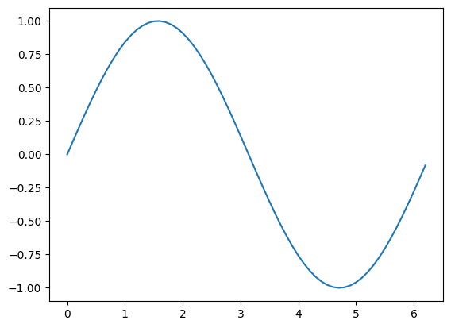

```python
# importing the required module
import matplotlib.pyplot as plt

# setting the x - coordinates
x = np.arange(0, 2*(np.pi), 0.1)
# setting the corresponding y - coordinates
y = np.sin(x)
  
# plotting the points
plt.plot(x, y)
  
# function to show the plot
plt.show()
```


    

    


form https://harlecin.netlify.app/post/jupter-notebooks-hugo/
https://pypi.org/project/hugo_jupyter/
